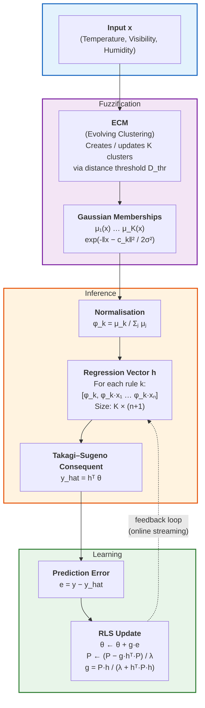

# Model Architecture

DENFIS (Dynamic Evolving Neural-Fuzzy Inference System) is an online, self-constructing neuro-fuzzy model that learns incrementally from streaming data. It combines:

1. **ECM (Evolving Clustering Method)** — an unsupervised clustering algorithm that creates/updates Gaussian membership functions (the *fuzzy rules*)
2. **Takagi–Sugeno (T–S) fuzzy inference** — each rule has a linear polynomial consequent mapping fuzzy activations to a real-valued output
3. **Recursive Least Squares (RLS)** — online optimisation of the consequent weights with exponential forgetting

## Architecture Diagram



## ECM — Evolving Clustering Method

The rule base starts empty. For each incoming sample `x`:

1. If no clusters exist → create one centred at `x`
2. Else find the nearest existing cluster centre (Euclidean distance)
3. If `d_min > D_thr` → create a new rule centred at `x`
4. Else update the winning cluster:
   - Centre ← moving average: `(centre * n + x) / (n + 1)`
   - Radius ← `max(radius, distance(x, new_centre))`

The distance threshold `D_thr` controls model complexity: lower values create more fine-grained rules; higher values yield fewer, broader rules.

## Gaussian Membership

For a given cluster `k` with centre `c_k` and radius `r_k`:

```
μ_k(x) = exp( -‖x − c_k‖² / (2 · (σ_k)²) )
```

where `σ_k = r_k · sigma_scale`. The membership represents how strongly the input activates rule `k`.

## Regression Vector (Takagi–Sugeno Consequent)

Membership values are normalised to sum to 1:

```
φ_k = μ_k / Σⱼ μⱼ
```

The regression vector `h` has block structure with one block per rule. For `K` rules and `n` features:

```
Block for rule k:  [ φ_k , φ_k · x₁ , φ_k · x₂ , …, φ_k · xₙ ]
```

Total parameter count: `K · (n + 1)`.

## RLS — Recursive Least Squares Learning

The consequent weight vector `θ` is updated online via RLS with forgetting factor `λ`:

```
y_hat = hᵀ θ                           (prediction)
e     = y − y_hat                       (error)
g     = P·h / (λ + hᵀ·P·h)             (Kalman gain)
θ    ← θ + g · e                       (weight update)
P    ← (P − g·hᵀ·P) / λ               (covariance update, forced symmetric)
```

When a new cluster is born, `θ` is zero-padded and `P` is extended with `init_cov` on the new diagonal entries.

### Key Parameters

| Param | Default | Effect |
|---|---|---|
| `D_thr` | 0.30 | Cluster distance threshold — lower = more rules |
| `sigma_scale` | 1.0 | Multiplier on cluster radius for Gaussian width |
| `lambda_forget` | 0.99 | RLS forgetting factor (1.0 = infinite memory) |
| `rls_init_cov` | 1000.0 | Initial covariance for new rule parameters (large = high initial learning rate) |

## Custom Logic Notes

- **Streaming data cleaning** — NaN values are replaced with reservoir-estimated per-feature medians, and sensor values are clipped to physically plausible ranges before training.
- **Stability guard** — RLS denominator is checked against `1e-12` to prevent division by zero; NaN-injected weight updates are silently discarded.
- **Feature normalisation** — `MinMaxScaler` is fitted on global min/max discovered in a single streaming pass, avoiding loading the full dataset into memory.
