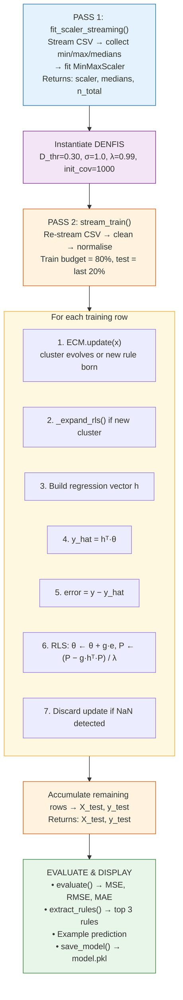
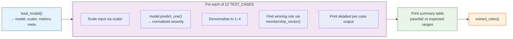
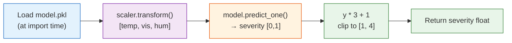

# Training Workflow

## train_model.py — `main()`

```mermaid
flowchart TB
    P1["PASS 1: fit_scaler_streaming()<br/>Stream CSV → collect min/max/medians<br/>→ fit MinMaxScaler<br/>Returns: scaler, medians, n_total"]
    M["Instantiate DENFIS<br/>D_thr=0.30, σ=1.0, λ=0.99, init_cov=1000"]
    P2a["PASS 2: stream_train()<br/>Re-stream CSV → clean → normalise<br/>Train budget = 80%, test = last 20%"]
    subgraph TrainLoop["For each training row"]
        T1["1. ECM.update(x)<br/>cluster evolves or new rule born"]
        T2["2. _expand_rls() if new cluster"]
        T3["3. Build regression vector h"]
        T4["4. y_hat = hᵀ·θ"]
        T5["5. error = y − y_hat"]
        T6["6. RLS: θ ← θ + g·e, P ← (P − g·hᵀ·P) / λ"]
        T7["7. Discard update if NaN detected"]
    end
    P2b["Accumulate remaining rows → X_test, y_test<br/>Returns: X_test, y_test"]
    E["EVALUATE & DISPLAY<br/>• evaluate() → MSE, RMSE, MAE<br/>• extract_rules() → top 3 rules<br/>• Example prediction<br/>• save_model() → model.pkl"]

    P1 --> M --> P2a --> TrainLoop --> P2b --> E

    style P1 fill:#e3f2fd,stroke:#1565c0
    style M fill:#f3e5f5,stroke:#7b1fa2
    style P2a fill:#fff3e0,stroke:#e65100
    style TrainLoop fill:#fff8e1,stroke:#f9a825
    style P2b fill:#fff3e0,stroke:#e65100
    style E fill:#e8f5e9,stroke:#2e7d32
```

## test_model.py — `main()`

```mermaid
flowchart LR
    L["load_model()<br/>→ model, scaler, metrics, meta"]
    subgraph Cases["For each of 12 TEST_CASES"]
        S["Scale input via scaler"]
        P["model.predict_one()<br/>→ normalised severity"]
        D["Denormalise to 1–4"]
        W["Find winning rule via<br/>membership_vector()"]
        O["Print detailed per-case output"]
    end
    T["Print summary table<br/>pass/fail vs expected ranges"]
    R["extract_rules()"]

    L --> Cases --> T --> R

    style L fill:#e3f2fd,stroke:#1565c0
    style Cases fill:#f3e5f5,stroke:#7b1fa2
    style T fill:#e8f5e9,stroke:#2e7d32
    style R fill:#fff3e0,stroke:#e65100
```

## predict_severity.py — `predict()`

```mermaid
flowchart LR
    L["Load model.pkl<br/>(at import time)"]
    S["scaler.transform()<br/>[temp, vis, hum]"]
    P["model.predict_one()<br/>→ severity [0,1]"]
    C["y * 3 + 1<br/>clip to [1, 4]"]
    R["Return severity float"]

    L --> S --> P --> C --> R

    style L fill:#e3f2fd,stroke:#1565c0
    style S fill:#f3e5f5,stroke:#7b1fa2
    style P fill:#fff3e0,stroke:#e65100
    style C fill:#e8f5e9,stroke:#2e7d32
    style R fill:#e8f5e9,stroke:#2e7d32
```
